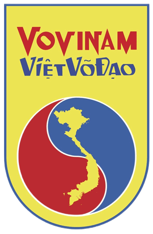

<div align="center">
  

  # Hệ thống Vấn đáp Lý thuyết Vovinam Việt Võ Đạo 🥋

  *Ứng dụng Web luyện thi lý thuyết Vovinam bằng công nghệ nhận dạng giọng nói (Speech-to-Text) dành cho sinh viên.*

  
  
  
  

  [👉 Xem Live Demo tại đây](https://ruhua2305.github.io/ly-thuyet-vovinam/)
</div>

---

## 📖 Giới thiệu
Dự án là một ứng dụng Web Single-Page (SPA) thuần túy (Vanilla JS), được xây dựng để hỗ trợ môn sinh Vovinam (đặc biệt là sinh viên Đại học FPT) ôn tập kiến thức võ đạo. Hệ thống mô phỏng trải nghiệm thi vấn đáp thực tế thông qua tính năng **đọc câu hỏi tự động** và **ghi âm/chấm điểm câu trả lời** bằng giọng nói.

## 📸 Ảnh chụp màn hình (Screenshots)
*(Thay thế các link dưới đây bằng ảnh chụp màn hình thực tế của ứng dụng)*

|" width="400" alt="Màn hình chính"> | " width="400" alt="Màn hình luyện tập"> |
|:---:|:---:|
| *Giao diện Trang chủ & Thống kê* | *Giao diện Luyện tập bằng Giọng nói* |

## ✨ Tính năng nổi bật
- 🎙️ **Tương tác bằng Giọng nói (Voice Interaction):** Tự động đọc câu hỏi (Text-to-Speech) và nhận diện câu trả lời qua Microphone (Speech-to-Text).
- 🧠 **Chấm điểm thông minh (Keyword Matching):** Tự động phân tích, chuẩn hóa văn bản và so khớp từ khóa để tính điểm phần trăm (%).
- 🎯 **4 Chế độ Luyện tập:**
  - `Thi thử`: Chọn ngẫu nhiên 3 câu hỏi (cân bằng độ dài) có tính thời gian.
  - `Học thuộc lòng`: Ôn luyện tuần tự toàn bộ ngân hàng câu hỏi.
  - `Flashcard`: Thẻ ghi nhớ lật mặt nhanh, không cần sử dụng mic.
  - `Ôn câu yếu`: Tự động gom các câu có điểm số dưới 50% để luyện lại.
- 📊 **Theo dõi Tiến độ Local:** Lưu trữ điểm số an toàn ngay trên trình duyệt, không cần cơ sở dữ liệu. Hỗ trợ Xuất/Nhập (Export/Import) file `.json`.
- ⚡ **Hoạt động Offline:** Giao diện SPA siêu nhẹ, không phụ thuộc vào framework backend (ngoại trừ tính năng nhận diện giọng nói cần kết nối internet của trình duyệt).

## 🛠 Cài đặt & Chạy dự án (Local Development)
Dự án được viết hoàn toàn bằng HTML/CSS/JS thuần nên không cần cài đặt các môi trường phức tạp (như Node.js).

1. **Clone repository này về máy:**
   ```bash
   git clone [https://github.com/ruhua2305/ly-thuyet-vovinam.git](https://github.com/ruhua2305/ly-thuyet-vovinam.git)
